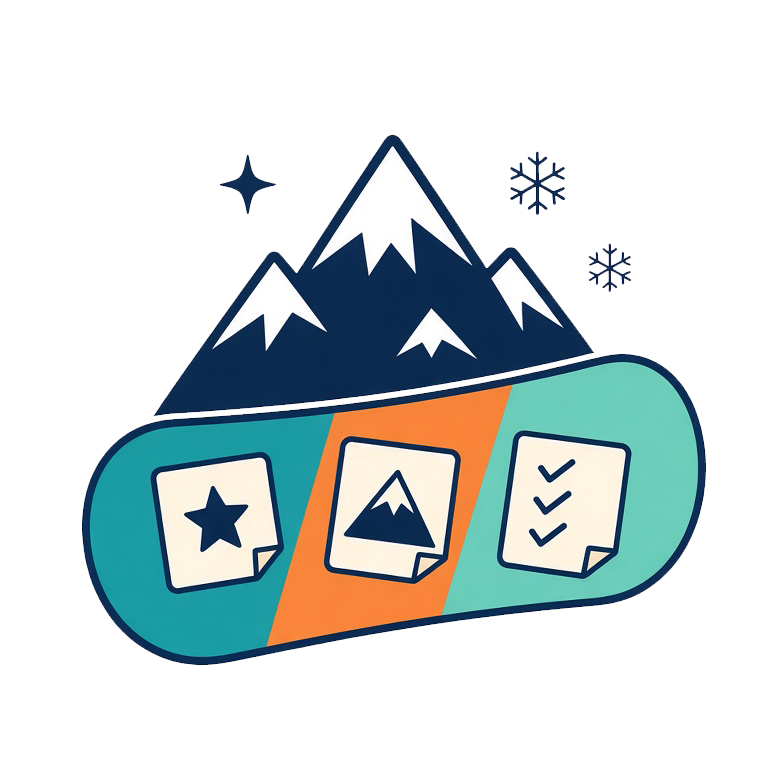
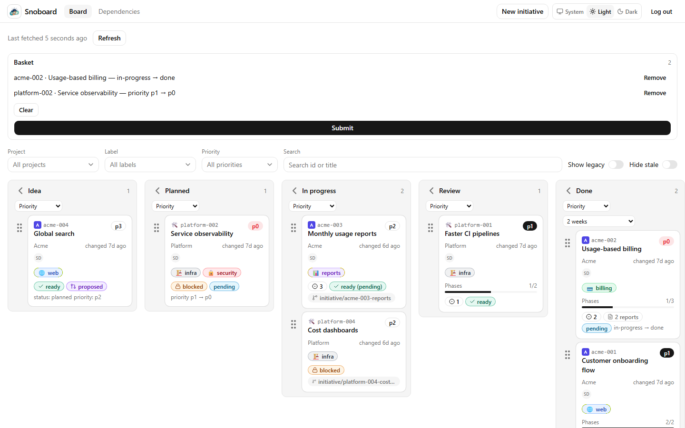
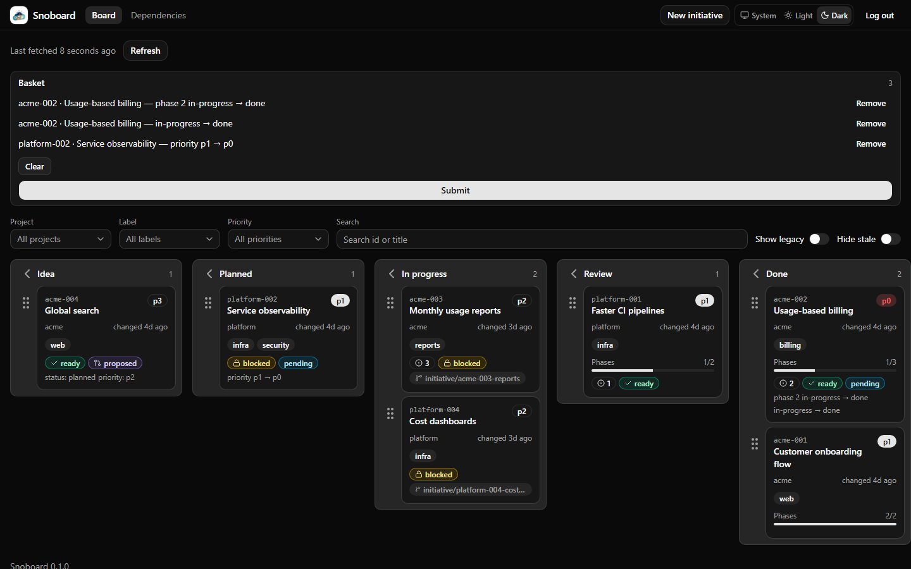
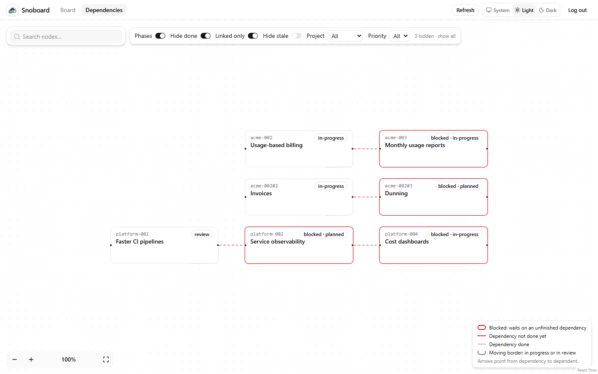
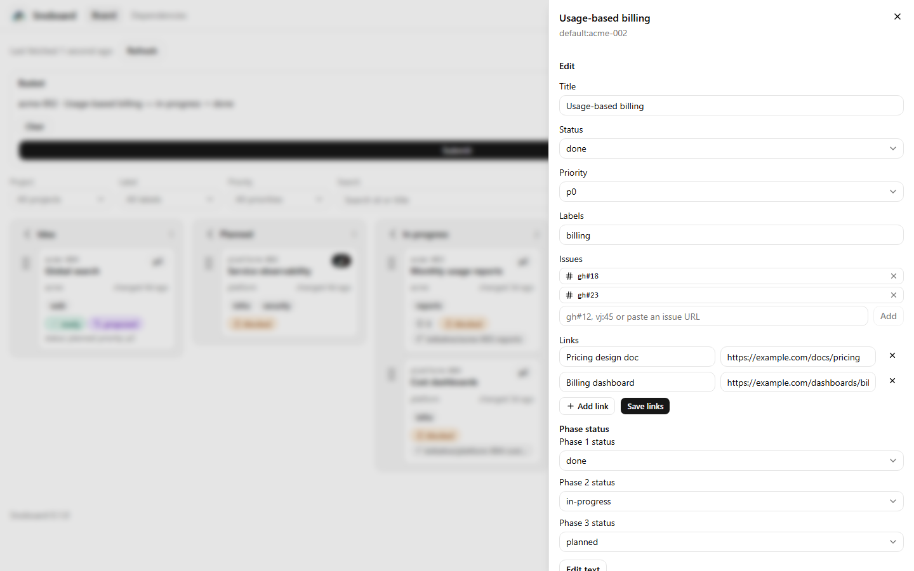
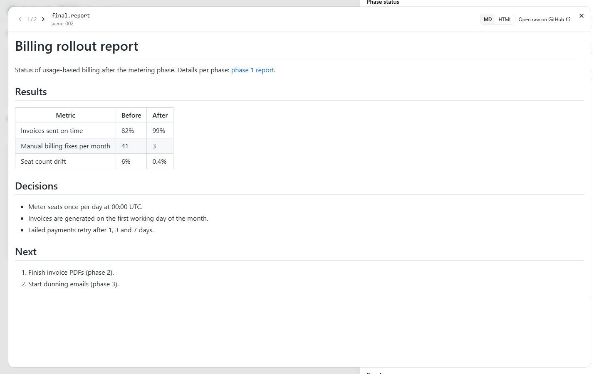
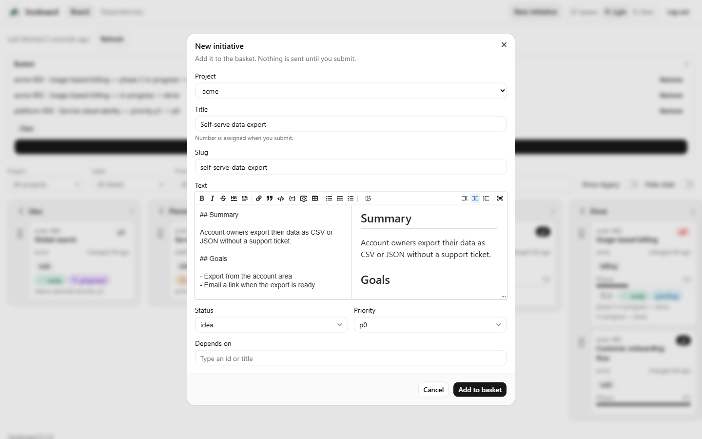
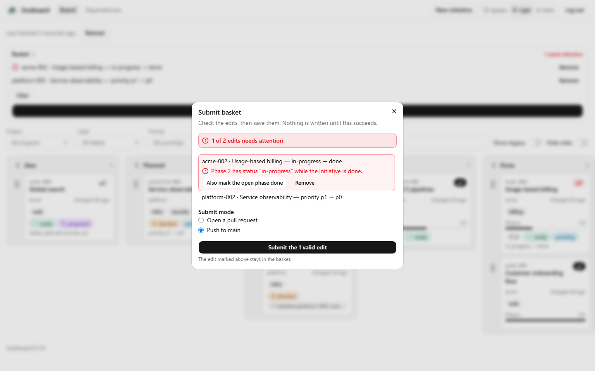
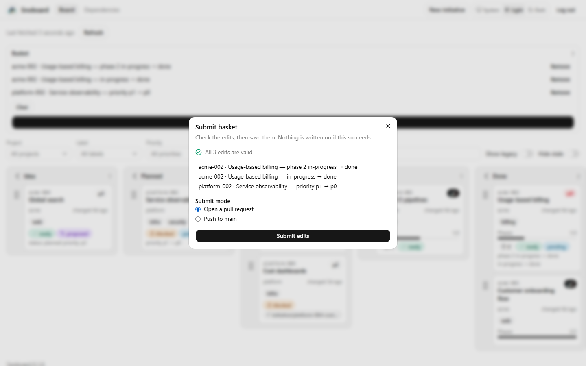

<p align="center"></p>

# Snoboard

**A git-native kanban board and dependency graph for `initiative.md` files. No database.**

Each initiative is a markdown file with YAML frontmatter (`status`, `priority`, `depends_on`, `phases`, `issues`, `links`, ...) in a git repository. Snoboard clones the repository, reads every branch, and shows a board and a dependency graph. Edits made in the browser go back to git as a commit or a pull request. Git stays the only source of truth.

It comes in three parts:

- the `snoboard` command, which creates, validates and fixes initiatives;
- a library that does the same work;
- the board web app, shipped as a Docker image and a Helm chart.

**Status: pre-release (0.1.0).** Apache-2.0.



## Features

### Board

- **One column per status.** The defaults are `idea`, `planned`, `in-progress`, `review`, `done`, `parked` and `dropped`. Change them with `statuses` in [`.snoboard.yml`](docs/configuration.md).
- **Drag and drop.** Dropping a card in another column queues a status edit in the basket. This only works when editing is on.
- **Fold columns.** Folded columns are remembered per repository.
- **Closed columns show recent cards.** Done, parked and dropped columns show only the last 14 days. `Show all (N)` expands them.
- **Stale cards.** An open initiative untouched for `staleAfterDays` (default 30) gets a `stale` badge. `Hide stale` filters these cards out.
- **Filters and search.** Filter by project, label and priority. Search by id or title. Filters live in the URL, so a filtered view can be shared as a link.
- **Card details.** Cards show `blocked` and `ready` badges, phase progress, issue counts, and the branch an initiative lives on.
- **Branches.** Initiatives that exist only on an `initiative/*` branch still appear. A legacy list shows folders without frontmatter.
- **Themes.** Light, dark or system.



### Dependency graph

The graph draws initiatives and, optionally, their phases. Arrows point from a dependency to the initiative that depends on it. Blocked initiatives and unfinished dependencies are highlighted.

- Filters: `Phases`, `Hide done`, `Linked only`, `Hide stale`, project and priority.
- Node search.
- A legend.



### Details panel

Open a card to see its summary, issues with their live title and open or closed state, phases with their pull requests, dependencies and dependents, the source file, branches, and external links. Each initiative also has its own full page.



Drag the panel's left edge to make it wider or narrower (or focus the handle and use the arrow keys, Home and End).
Double-click the handle to go back to the default width. The width is remembered in the browser.

### Icons

Give projects an emoji or a logo from the repository, and labels an emoji and a colour, in `.snoboard.yml`; an
initiative can override its project icon with an `icon` frontmatter field. Icons show on cards, in the details panel,
in graph nodes and in the project pickers, which also count open initiatives per project. See
[docs/configuration.md](docs/configuration.md#icons).

### Reports

Files under `<initiative folder>/reports/` (`phase-1.report.md`, `final.report.md` and their `.report.html` twins)
show in the details panel: initiative reports in a **Reports** section, phase reports as chips on their phase, and a
"N reports" mark on the card. They open in a large viewer with previous/next and an md/html switch. HTML reports
render statically in a sandbox, without scripts. See [docs/configuration.md](docs/configuration.md#reports).



### Editing basket

Edits collect in a basket in the browser. Nothing is written until you submit.

- **Fields.** You can edit the title, status, priority, labels, issue refs, external links, phase status, and the body text. The body uses a markdown editor with a live preview.
- **Images.** Paste, drop or attach PNG, JPEG, WebP or GIF images. They are committed next to the initiative.
- **New initiative.** Pick the project, title and slug, write the text, set status and priority, and choose dependencies. The number is assigned when you submit, as the next free number in that project.
- **Proposed changes.** Edits that are pushed but not merged show on the card as `proposed`, with the new values.



### Submitting

The **Submit** dialog validates the basket on the server, then writes it in one of two ways:

- **Push** commits to the configured branch.
- **Open a pull request** creates an edit branch and a PR.

The dialog remembers your choice for each repository. If a direct push is rejected, `Open a PR instead` retries the same basket as a PR.

Each edit that fails validation is marked with a readable reason, and the header counts them ("1 of 2 edits needs attention"). For a failing edit you can:

- **Remove** it.
- **Apply a one-click fix** where one is known. For example, `Also mark the open phase done` queues the missing phase edits.
- **Submit only the valid edits.** The invalid ones stay in the basket.

The basket panel also marks the failing rows.

| Invalid edits | After the one-click fix |
| --- | --- |
|  |  |

### Identity and access

- **Sign-in modes:** `password`, `github` (OAuth), `cloudflare-access`, or `none` for local use.
- **Commit authorship.**
  - GitHub users commit as themselves. Snoboard asks for write access at their first submit.
  - Cloudflare Access users can connect their GitHub account at submit.
  - Otherwise, an optional bot token writes the commit. A trailer records who made the edit.
- **Read-only users.** A sign-in without write access can view the board but not submit.

See [docs/auth.md](docs/auth.md) and [docs/editing.md](docs/editing.md).

### Multiple repositories

One board can serve several repositories, listed in a repos file (`SNOBOARD_REPOS_FILE`, see [`examples/repos.example.yaml`](examples/repos.example.yaml)). A `Repository` switcher appears in the header. Each repository has its own URL (`/r/<id>/`), basket, edit settings and issue trackers.

### Issue and external links

- **Issue refs.** An initiative lists related issues as short refs: `gh#12`, `gh:owner/name#12`, `fj#12` / `fj:owner/name#12` (Forgejo or Gitea), or `vj:45` (Vikunja). Pasting a GitHub, Forgejo or Vikunja issue URL turns it into a short ref. **New issue** creates an issue in one of the configured trackers and links it to the initiative; otherwise Snoboard only reads the trackers.
- **External links.** `links` holds titled `https:` or `mailto:` links, such as design docs or dashboards.

## CLI

```sh
npm i -g snoboard            # or: pnpm dlx snoboard --help

snoboard new acme search --title "Search"   # writes initiatives/acme/001-search/initiative.md
snoboard validate                           # exit 1 when an opted-in file has an error
snoboard fix --dry-run                      # preview normalised statuses, ids, dates, lists
snoboard status --ready                     # table of initiatives; --json for JSON
snoboard next-number acme                   # next free number for a project
```

Details are in [docs/cli.md](docs/cli.md). The file format is in [docs/schema.md](docs/schema.md).

## Quick start

### Local demo from source

This needs Node 24.18 or later and pnpm.

```sh
pnpm install
pnpm build
node examples/make-demo-remote.mjs ./snoboard-demo.git

SNOBOARD_REPO_URL="file://$PWD/snoboard-demo.git" \
SNOBOARD_AUTH_MODES=none SNOBOARD_AUTH_ALLOW_NONE=true \
SNOBOARD_DATA_DIR=./.snoboard-data \
node apps/board/dist/server/index.mjs
```

Then open `http://localhost:8080`. `none` mode has no sign-in, so use it only on your own machine. The demo repository is the one the screenshots above come from.

### Docker

```sh
docker run --rm -p 8080:8080 \
  -e SNOBOARD_REPO_URL=https://github.com/acme/initiatives.git \
  -e SNOBOARD_AUTH_MODES=password \
  -e SNOBOARD_PUBLIC_URL=http://localhost:8080 \
  -e SNOBOARD_PASSWORD_HASH_FILE=/run/secrets/password.hash \
  -e SNOBOARD_SESSION_SECRET_FILE=/run/secrets/session.secret \
  -v "$PWD/password.hash:/run/secrets/password.hash:ro" \
  -v "$PWD/session.secret:/run/secrets/session.secret:ro" \
  ghcr.io/serrnovik/snoboard:0.1.0
```

[docs/deploy.md](docs/deploy.md) shows how to create the password hash and session secret.

### Helm

```sh
helm install snoboard deploy/helm/snoboard \
  -f deploy/helm/snoboard/values-existing-secret.example.yaml
```

The chart runs as a non-root user with a read-only root filesystem and health and readiness probes. [docs/deploy.md](docs/deploy.md#helm) covers secrets, ingress and the multi-repository overlay.

## Documentation

| Topic | File |
| --- | --- |
| Initiative frontmatter, phases, links, validation rules | [docs/schema.md](docs/schema.md) |
| `.snoboard.yml`, issue trackers, several repositories | [docs/configuration.md](docs/configuration.md) |
| Commands and exit codes | [docs/cli.md](docs/cli.md) |
| Sign-in modes and write tokens | [docs/auth.md](docs/auth.md) |
| Edit modes, images, bot token, submit flow, limits | [docs/editing.md](docs/editing.md) |
| Initiative and phase reports, the report viewer | [docs/configuration.md](docs/configuration.md#reports) |
| Environment variables, Docker, Helm, health checks | [docs/deploy.md](docs/deploy.md) |
| Reporting vulnerabilities, threat model for the write path | [SECURITY.md](SECURITY.md) |
